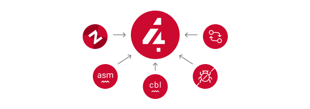

# Code4z

Code4z is an all-in-one mainframe extension package for developers working with z/OS applications, suitable for all levels of mainframe experience, even beginners.

Mainframe application developers can use the Code4z package for a modern, familiar, and seamless experience, which helps to overcome some developers' reservations or concerns about the traditional mainframe user experience.

Developers can now find the code they need to work on in Explorer for Endevor and Zowe Explorer, edit code assisted by COBOL or HLASM Language Support, and test the resulting code with the Debugger, all in one Mainframe development package.

  

Powered by open source projects [Zowe](https://www.zowe.org/) and [Che](https://www.eclipse.org/che/). Many of these extensions, and other mainframe-oriented innovations, are also available as part of open source [Eclipse Che4z subproject](https://github.com/eclipse/che-che4z).

## What’s New
* 2020-07-07 - [COBOL Language Support](https://marketplace.visualstudio.com/items?itemName=broadcomMFD.cobol-language-support) (0.12) now supports locally stored copybooks.

* 2020-07-02 - [Explorer for Endevor](https://marketplace.visualstudio.com/items?itemName=broadcomMFD.explorer-for-endevor) (0.10) includes the following updates:

  * New Profile Experience:
    * Create Endevor plug-in for Zowe CLI profiles directly in Explorer for Endevor.
    * Use any Endevor profiles that you have created in the CLI in Explorer for Endevor.
  * Deprecation of support for CA Endevor Bridge for Git mappings.

* 2020-07-01 - [Zowe Explorer](https://marketplace.visualstudio.com/items?itemName=Zowe.vscode-extension-for-zowe) (1.7) includes the following updates:

  * Credentials check feature that allows users to update their credentials if they receive an authorization error.
  * Profile validation feature that checks whether a profile is valid. 
  * Editing of search filters.
  * Editing of ASCII files in USS.
  * And more

  For the comprehensive list of updates, see [Changelog](https://marketplace.visualstudio.com/items/Zowe.vscode-extension-for-zowe/changelog).

## Prerequisites

* Java installed on your machine.
* Individual extension prerequisites are detailed in the individual readme files linked below.

## [COBOL Language Support](https://marketplace.visualstudio.com/items?itemName=broadcomMFD.cobol-language-support)

COBOL Language Support provides autocomplete, highlighting and diagnostic features for COBOL code and copybooks.

The Code4z package includes a bitlang [COBOL extension](https://marketplace.visualstudio.com/items?itemName=bitlang.cobol) which provides an enhanced experience while working with COBOL Language Support and enables syntax coloring.

> How can we improve COBOL Language Support? [Let us know on our Git repository](https://github.com/eclipse/che-che4z-lsp-for-cobol/issues)

### Features
* Edit COBOL code with syntax highlighting, real time syntax validation, content assist and other advanced features.
* Automatic retrieval of copybooks from the mainframe.

### Blogs
* [Beginner’s Guide: COBOL Made Easy](https://medium.com/modern-mainframe/beginners-guide-cobol-made-easy-introduction-ecf2f611ac76)
* [LSP Magic - Mainframe Language Support in Modern IDEs](https://medium.com/modern-mainframe/lsp-magic-mainframe-language-support-in-modern-ides-4ea3d81259b3)

## [HLASM Language Support](https://marketplace.visualstudio.com/items?itemName=broadcomMFD.hlasm-language-support) 

Code completion, highlighting, browsing and validation for High Level Assembler language.

> How can we improve HLASM Language Support? [Let us know on our Git repository](https://github.com/eclipse/che-che4z-lsp-for-hlasm/issues)

### Features
* Edit HLASM code with syntax highlighting, real time syntax validation, content assist and other advanced features.
* Trace HLASM macros.

### Links
* [HLASM Language Support Wiki](https://github.com/eclipse/che-che4z-lsp-for-hlasm/wiki)

## [Zowe Explorer](https://marketplace.visualstudio.com/items?itemName=Zowe.vscode-extension-for-zowe) 

Zowe Explorer is a VS Code extension powered by Zowe CLI that streamlines interaction with mainframe data sets, USS files, and jobs. The extension is designed to function along with other extensions and plug-ins to deliver a richer experience.

You can learn more about the Zowe Explorer by watching the [Getting Started](https://www.youtube.com/embed/G_WCsFZIWt4) and [Work with Data Sets](https://www.youtube.com/embed/X4oSHrI4oN4) tutorial videos.

> How can we improve Zowe Explorer? [Let us know on our Git repository](https://github.com/zowe/vscode-extension-for-zowe/issues)

### Features
* Access z/OS Datasets and z/OS Unix file systems, and submit JCLs.
* Create, edit, and work with z/OSMF compatible profiles.
* Store your credentials securely with Secure Credentials Store plug-in.
* View and download job output.
* Issue TSO commands.
* Install additional extensions.

### Blogs
* [Beginner’s Guide: How to access mainframe via Zowe in 10 easy steps](https://medium.com/zowe/beginners-guide-how-to-access-mainframe-via-zowe-in-10-easy-steps-fbec14ed6ed2)
* [Zowe blog](https://medium.com/zowe)

## [Explorer for Endevor](https://marketplace.visualstudio.com/items?itemName=broadcomMFD.explorer-for-endevor)

Explorer for Endevor gives you the ability to Browse and Retrieve [CA Endevor® SCM](https://www.broadcom.com/products/mainframe/devops-app-development/app/endevor-software-change-manager) elements using a user-friendly, intuitive interface.

This extension offers best developer experience in synergy with [Bridge for Git](https://youtu.be/sjnZuQpUVM4), a solution which enables you to concurrently work in Git and mainframe.

> How can we improve Explorer for Endevor? [Let us know on our Git repository](https://github.com/eclipse/che-che4z-explorer-for-endevor/issues)

### Features
* Retrieve, browse and search CA Endevor® elements.

## [Debugger for Mainframe](https://marketplace.visualstudio.com/items?itemName=broadcomMFD.debugger-for-mainframe)

Debugger for Mainframe provides the debugging interface to [CA InterTest™ for CICS](https://www.broadcom.com/products/mainframe/devops-app-development/testing-quality/intertest-cics). This extension provides a modern debug experience for COBOL applications running in a CICS region.

> How can we improve Debugger for Mainframe? [Let us know on our Git repository](https://github.com/BroadcomMFD/debugger-for-mainframe/issues)

### Features

* Debug COBOL code for applications running in a CICS region.

### Videos

* [Getting started / Debugger for Mainframe 101](https://www.youtube.com/watch?v=f6ZxwALSb_Y&feature=youtu.be)

## Sample Workflows

### COBOL Language Support using CA Endevor Bridge for Git and Explorer for Endevor
* Use VS Code’s built-in Git interface to clone source code from CA Endevor using Endevor’s Bridge for Git.
* Edit COBOL code using COBOL Language Support, taking advantage of all the coding assistance provided by the extension.
* Locate all copybooks in the Git folder structure, and if needed, download other copybooks used in the source code from the mainframe.
* Use VS Code’s built-in Git interface to push, pull and merge changes.
* Search and browse additional code elements in the entire map of Endevor using the Explorer for Endevor extension. The COBOL Language Support extension provides syntax awareness for COBOL elements.
* Download code elements, including their dependencies, into the current workspace using the Explorer for Endevor extension, and synchronize them with the Git project if code modifications are needed.

### Debugger for Mainframe

* Provide InterTest server location, CICS region, credentials and program/transaction name (either by file or input form).
* Obtain the listing and set breakpoints.
* Trigger the CICS transaction and start a debug session.
* Display and change variable values.
* Stop at designated breakpoints, continue from a designated breakpoint and step through the listing.
* Close the debug session.

### Zowe Explorer and Zowe CLI

* Access mainframe files and execute jobs, either from an interactive graphical interface or in the terminal with CLI. Whether you want to view a PDS, allocate a dataset, change a JCL, submit a mainframe compile, or download and upload files, both interfaces provide these capabilities.
